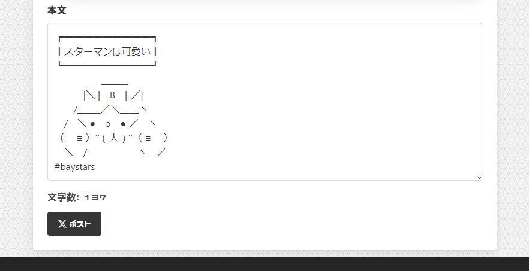

# baseball-tweet


X(旧Twitter)にて、使用している野球実況用の Webページ

[Web Page Link](https://ant2357.github.io/baseball-tweet/ "Web Page Link")

## Project setup
```
npm install
```

### Compiles and hot-reloads for development
```
npm run serve
```

### Compiles and minifies for production
```
npm run build
```

### Lints and fixes files
```
npm run lint
```

### Customize configuration
See [Configuration Reference](https://cli.vuejs.org/config/).
